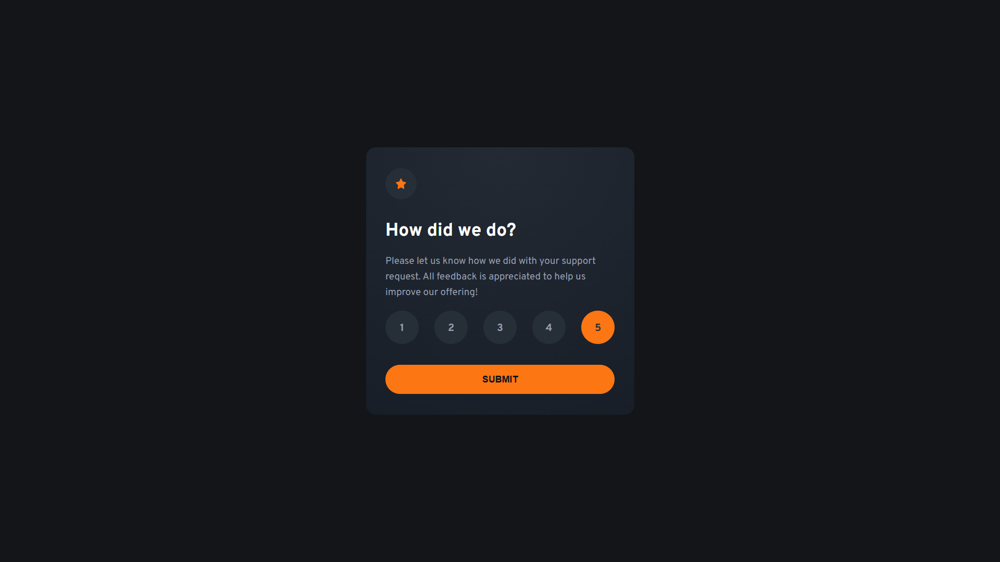
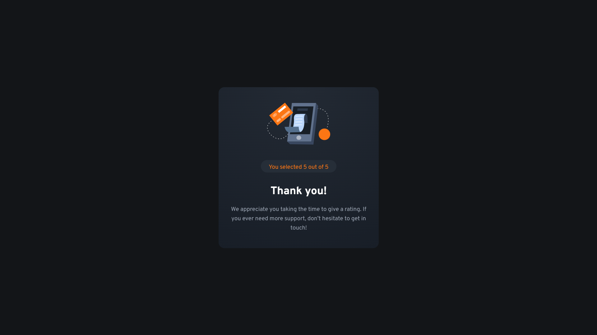

# Frontend Mentor - Interactive rating component solution

This is a solution to the [Interactive rating component challenge on Frontend Mentor](https://www.frontendmentor.io/challenges/interactive-rating-component-koxpeBUmI).

## Table of contents

- [Overview](#overview)
  - [The challenge](#the-challenge)
  - [Screenshot](#screenshot)
  - [Links](#links)
- [My process](#my-process)
  - [Built with](#built-with)
  - [What I learned](#what-i-learned)
  - [Continued development](#continued-development)
- [Author](#author)

## Overview

### The challenge

Users should be able to:

- View the optimal layout for the app depending on their device's screen size
- See hover states for all interactive elements on the page
- Select and submit a number rating
- See the "Thank you" card state after submitting a rating

### Screenshot





### Links

- Solution URL: [GitHub](https://github.com/g-akca/interactive-rating-component)
- Live Site URL: [Interactive Rating Component](https://g-akca.github.io/interactive-rating-component/)

## My process

### Built with

- Semantic HTML5 markup
- CSS custom properties
- Flexbox
- CSS Grid
- Mobile-first workflow
- Media queries
- CSS animations
- Dynamic JavaScript

### What I learned

This was the first time I tried out CSS animations on a project alongside JavaScript support, making the card pop in and out when the form is submitted. I really like how it looks.

```css
.card-exit {
    animation: cardExit 0.3s ease forwards;
}

.card-enter {
    animation: cardEnter 0.3s ease forwards;
}

@keyframes cardExit {
    0% {
        transform: scale(1);
        opacity: 1;
    }
    100% {
        transform: scale(0.8);
        opacity: 0;
    }
}

@keyframes cardEnter {
    0% {
        transform: scale(0.8);
        opacity: 0;
    }
    100% {
        transform: scale(1);
        opacity: 1;
    }
}
```
```js
card.classList.add("card-exit");

setTimeout(() => {
    ratingContent.hidden = true;
    thanksContent.hidden = false;

    card.className = "thanks-card card-enter";
}, 400);
```

### Continued development

I want to continue using animations for a nicer and more modern look on my projects.

## Author

- GitHub - [@g-akca](https://github.com/g-akca)
- Frontend Mentor - [@g-akca](https://www.frontendmentor.io/profile/g-akca)